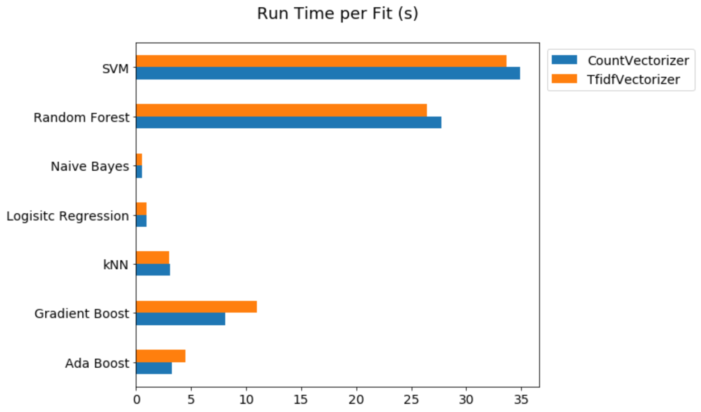

#  Project 3: Scraping and Classification of two Subreddit Posts

### Overview

In Project 3, we are going to collect posts from two subreddits of our choice using Reddit's API. Then we use Natural Language Processing to train a classifier on which subreddit a given post came from.

Here, I chose the subreddits **Science** and **Psychology** for the sake of trying scraping and classification algorithms. These two subreddits although are fundamentally distinct, however, they have some overlap which prevents the classifier to be completely trivial. 

### Phase 1: Scraping

In order to scrape the posts from these two subreddits, initially I tried to use the Reddit's API itself. However, after an attempt I realized that there is a large number of duplicated posts in my collected data. I was particularly careful to grab only 500 posts at each trial and assign the parameter `after` correctly, but at the end I found lots of posts with the similar Id's in my gathered data frame.

So, I decided to use the Pushshift API which provides a more reliable means to collect a large number of posts from Reddit. For each subreddit, I collected numerous posts in batches of 500 and to avoid having duplicated posts, I sorted the grabbed posts chronologically and at the end of each round of scraping I set the parameter `before` in the API equal to the posting time of the oldest collected post. Then, I stored the `Id` (the unique identifier of each post), the `title` (the title of that post), the `selftext` (the body text of that post), and the `subreddit` of each collected post in a data frame. Using Pushshift API, I could collect 10,000 posts from `r/science` and 9,991 posts from `r/psychology`. Finally, I saved the collected data as different CSV files for each subreddit.

### Phase 2: Data Cleaning

After importing the data sets of each subreddit, both were concatenated into a single data frame so the new features and modifications will be performed on both. Then, I dropped the posts where either their title or their text were deleted. At the end of this step, I created a new column called `content` and in that I concatenated the title and text of each post.

Next, I defined a function to preprocess the content of each file by removing the URLs, punctuation marks, and numbers and converting all the remaining words into lower case. Then, I applied this function for each post given in different rows of the `content` column. In the next step, I dropped the posts which either had empty content or their content was in a language other than English. In order to detect the language of each post, I utilized the `langdetect` package. At the end, I had 18,481 posts to perform the modeling. Finally, I shuffled the data frame to have a random placement of Science and Psychology subreddits and then I stored the resulting data into a new CSV file.

### Modeling 

In order to train a classifier, I decided to employ a variety of different machine learning techniques and compare their capability in distinguishing the subreddit of each post. First, to vectorize the text data, I used two different vectorizers:

- Count Vectorizer
- TF-IDF Vectorizer

Also, to train a classifier based on the vectorized data, I utilized the following classification models:

* Logistic Regression
* $k$-nearest neighbors
* Multinomial Naive Bayes
* Random Forest
* Adaptive Boosting
* Gradient Boosting
* Support Vector Machine

Some of these models are simple yet quick algorithms and some are very complex and time-consuming ones. In order to connect the vectorizer and the classifier, I defined a pipeline which automatically pairs each vectorizer with each different classifier method. Then, I used this pipeline in a grid search algorithm to find the optimal parameters for each pair. For each vectorizer, I checked if keeping or removing stop words and if using unigrams or bigrams yields better accuracy. Also, for each classifier, I tried to search over a limited set of hyper-parameter values to find the highest classification accuracy. In the output file, saved as a CSV file, I stored the set of best parameters for each pair and the accuracy and recall scores for train and test data sets. The following graphs represent the accuracy of classification method for the train and test data, respectively,

These results indicate that almost in all cases, the TF-IDF vectorizer either performs as good as or better than the Count vectorizer. Also, the top three classifiers are: SVM, Naive Bayes, and Logistic Regression. Considering the simplicity and speed of the last two algorithms, it is interesting to see how accurate they are too in order to correctly predict the subreddit of each post. 

Since I set `verbose=1` in the grid search parameters, I was able to store the number of fits and the run time of each pair of algorithms. By dividing these two parameters, I could find the run time of each technique per number of fits which is illustrated in the following figure,

It is interesting to see how fast are the Naive Bayes and Logistic Regression algorithms and in comparison how slow are the Random Forest and SVM methods. Also, this plot shows that the type of vectorizer does not have a substantial impact on the run time of various classifier algorithms. 
